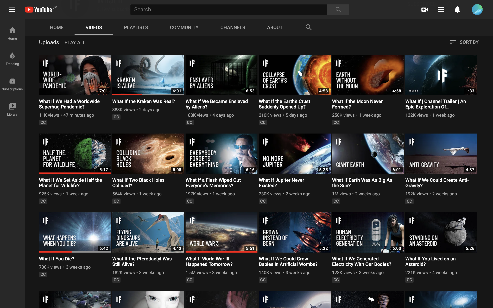

# `what if` channelの日本版

---

## `what if` channelとは

アメリカの「もしも」~なったらチャンネル https://www.youtube.com/channel/UCphTF9wHwhCt-BzIq-s4V-g

- 登録者 300万人超え
- 視聴回数 272,767,161 views
- Joined Jul 18, 2018

---

わずか一年半でこの伸び、youtubeやっぱり恐ろしい

おそらく、
このチャンネルのみで最高で年商1億いく

---

---

## 利点

- バズリの再現性 -> バズった動画の日本語版を大量生産
- 初期費用0 -> ゴリゴリやっていくだけ
- クリエイティビティが不要 -> 動画編集のみでOK

---

## 欠点

- すでに日本版が登場
https://www.youtube.com/channel/UCZsNFZoQReRLkDb3AsqZKDg
- しかし、苦戦している模様
- 日本に適した動画編集・プロヂュースの仕方次第で伸びるのではと
