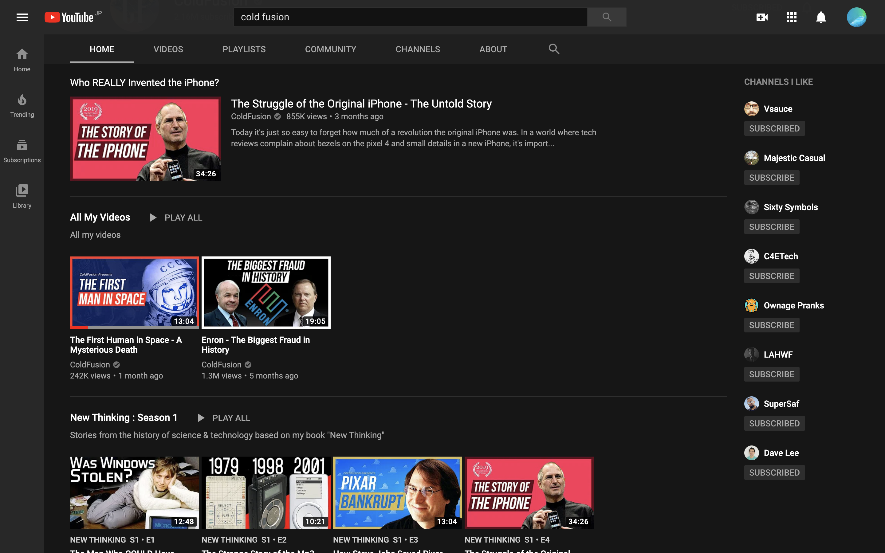

# documentary テクノロジー系

---

個人がやるテクノロジー系のdocumentary、
まじで日本だと
ブルーオーシャン

---

---

documentary自体がそうかもw

---

- https://www.youtube.com/user/Top10Memes
- https://www.youtube.com/user/coldfustion
- https://www.youtube.com/user/Computerphile

---

これに関しては、
わりと
個人プレイです

---

利点

- 流行り廃れがない
- 中田channelのドキュメンタリーversion
- 著作権の心配が薄い(ファクトベース)

---

欠点

- スケールしにくい
- 最初は伸びない
- 属人性・ブランド性どちらも薄い
