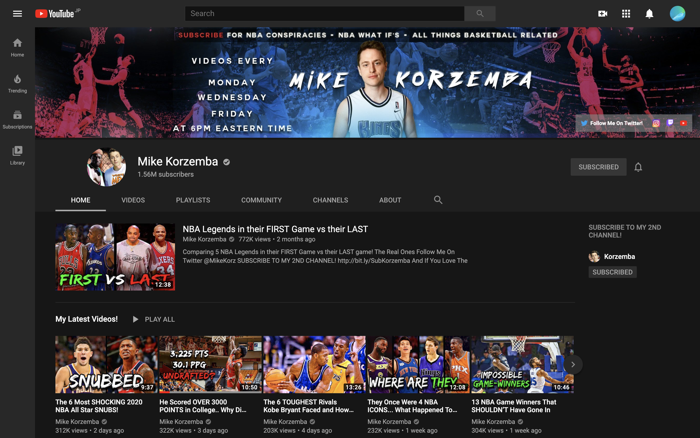

# スポーツ ドキュメンタリー

---

https://www.youtube.com/channel/UC3L9XPe0_FGfRG-CMGtBvFg
https://www.youtube.com/channel/UCp3dgMf1OUP2XqOpyOY2bzQ
https://www.youtube.com/watch?v=KF6iwEkdbYI

---

これも、日本まじで
ブルーオーシャン
(マーケットは小さい)

---

---

例

- イチローの武勇伝・伝説の話とか
- ジョーダンの逸話
- スポーツ関連の旬な選手の生い立ちの話

---

利点

- 他のsnsへの転用のしやすさ(tiktok)
- スポーツsnsとして確立可能
- 割とブランドを確立しやすい

---

欠点

- 視聴者のリテラシー低い
- 広告単価の低さが露呈
- 著作権の関係性悪い
