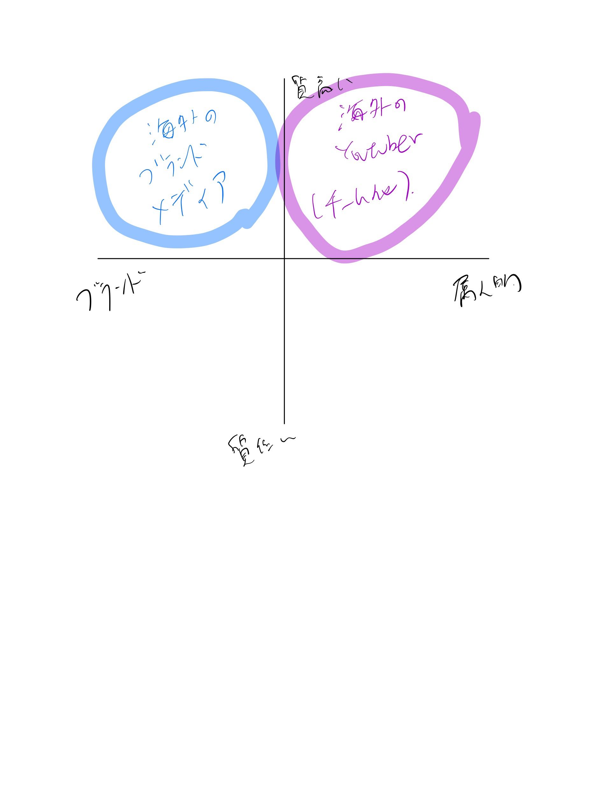
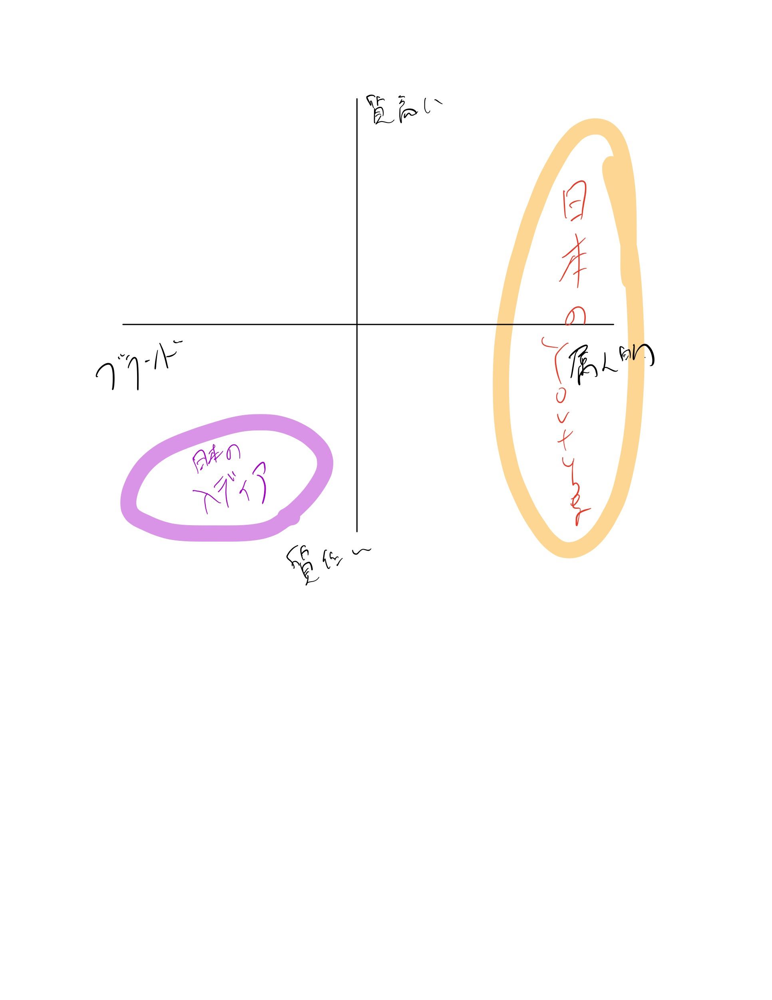
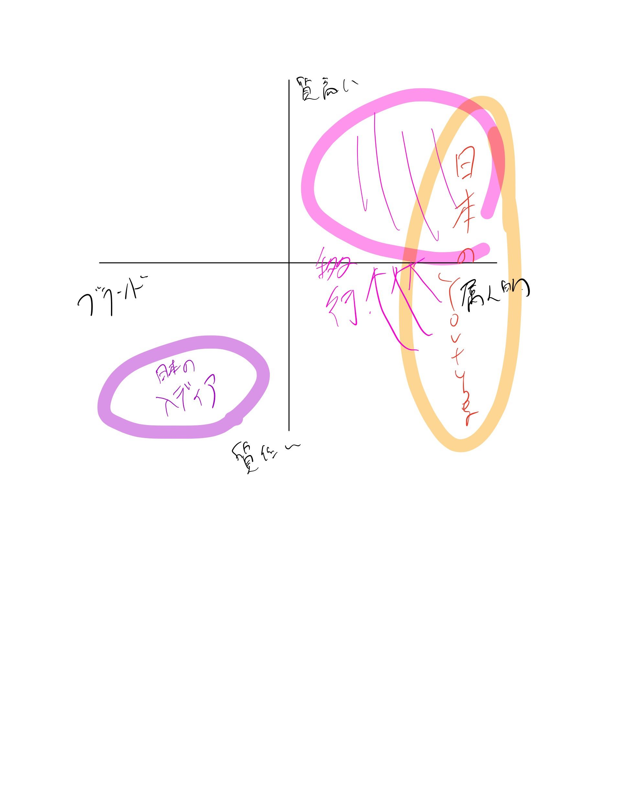
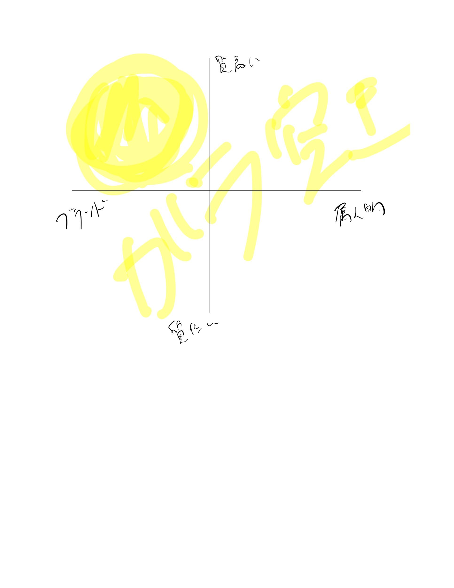

# 今後3年で日本のyoutube界隈に起きること

---

---

---

---

---

1. ブランド性のある
2. 質の高い
3. 組織的に運営されている

メディアが登場する

---

日本では未だない、
全て属人的

---

その第一人者となれば
他分野でも
再現性が働く

---

予想

登録者数100万人規模のメディアは
30億Levelで
バイアウト可能

---

そのために最適なセクターは

- 芸能関係
- ゲーム(esports)
- テクノロジー系
