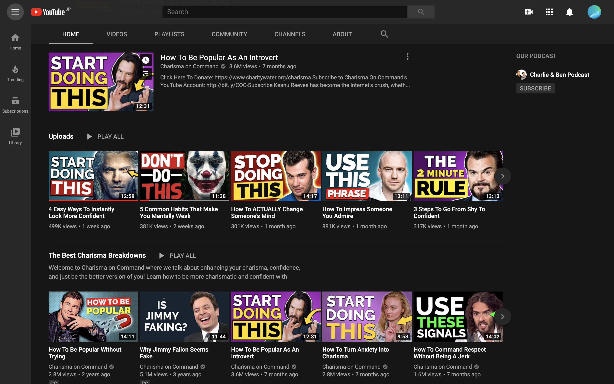

# メンタル brand メディア

---

日本におけるメンタル系youtuber

- daigo(https://www.youtube.com/user/mentalistdaigo/videos?app=desktop)
- 仮メンタリストえる(https://www.youtube.com/channel/UCoR01KQRDnox6FBIn5Nc-YQ)
- クリスの部屋(https://www.youtube.com/channel/UCfqRMJrg010qS35Kj_dhuKA)

全て属人的

---

海外だと

- https://www.youtube.com/user/charismaoncommand/featured
- https://www.youtube.com/channel/UCAPByrKU5-R1emswVlyH_-g
- https://www.youtube.com/user/phuckmediocrity/videos

属人性は薄い
ブランド性が確立されている

---

---

戦略

- メンタルに特化して
- 恋愛・コミュ力・カリスマ性
- を体系的に伝えるブランドメディア

---

利点

- 質の高いコンテンツを大量生産可能
- やや属人的
- 関心の層が幅広い

---

欠点

- 属人性が日本人は好み!?
- レッドオーシャン
- スケールまで時間がかかる
