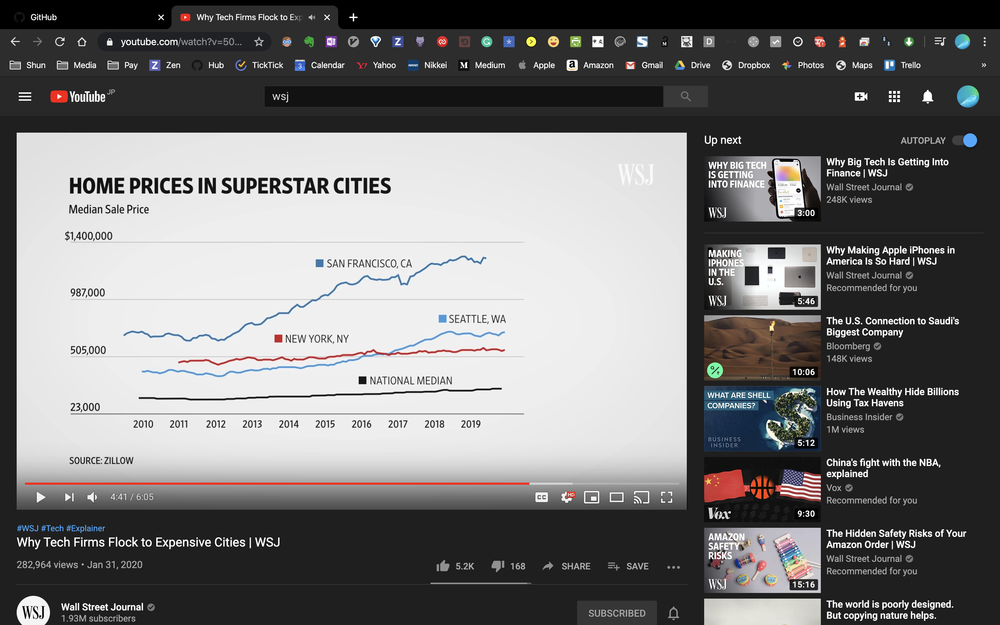

# ビジネス系短編ドキュメンタリー

---

これだ!!!

割と確度高いセクターかもしれん

ではいきます

---

海外の新聞社

- WSJ(https://www.youtube.com/channel/UCK7tptUDHh-RYDsdxO1-5QQ)
- Business Insider(https://www.youtube.com/user/businessinsider)
- NYT(https://www.youtube.com/user/TheNewYorkTimes)
- Bloomberg(https://www.youtube.com/channel/UCUMZ7gohGI9HcU9VNsr2FJQ)
- CNBC(https://www.youtube.com/channel/UCo7a6riBFJ3tkeHjvkXPn1g)

---

各社いずれもビジネス系短編ドキュメンタリー
を大量生産
(youtubeにおける記事みたいな感覚)

---

---

- 未だ日本で新聞社でやってるところはなし
- documentary分野は未開拓
- 体系的に高品質の動画生産可能

---

さらに

---

- 視聴層の広告単価が高い
- 二次的な事業に繋げやすい
- 色々なsnsに運用可能

---

しかし

- 最初は権威性なし
- 1動画あたりコスト高い
- 持久戦
