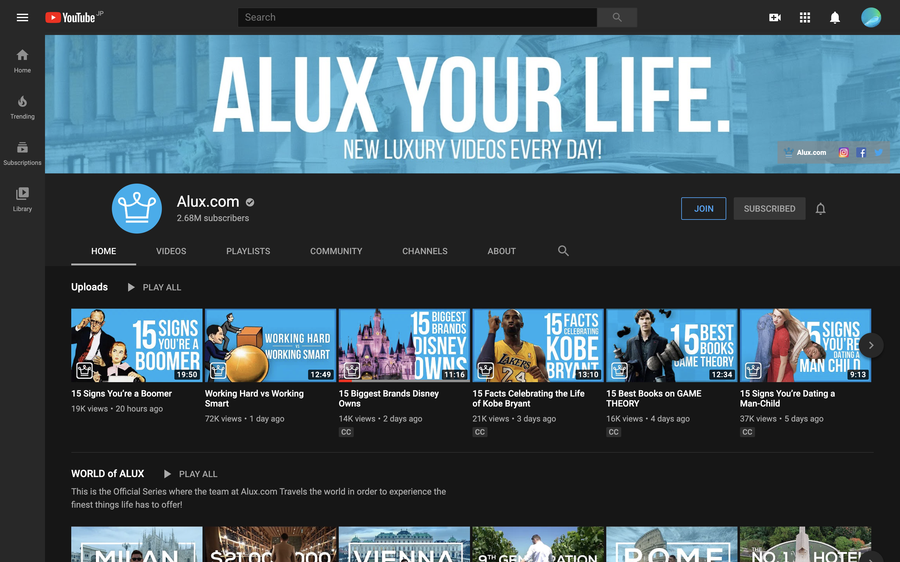

# luxury専門メディア

---

日本って有数のブランド大好き国

Source:https://www.youtube.com/watch?v=aF4Mqe08d88

---

luxury系のmediaブランドを確立するのは容易

日本の国民性に合致

---

海外の代表

Alux

- Joined Oct 27, 2013
- 302,027,127 views
- https://www.youtube.com/channel/UCNjPtOCvMrKY5eLwr_-7eUg

---

---

施策

- Luxury・資産・金持ちになるためのコンテンツを提供
- 中品質の動画を毎日生産
- ブランド感を統一

---

利点

- 伸びやすい・バズりやすい
- コストがかからない
- 大量生産しやすい

---

欠点

- ゴミカスチャンネルにならないような工夫
- ブランド感を演出しにくい
- 他のsnsで展開しにくい
