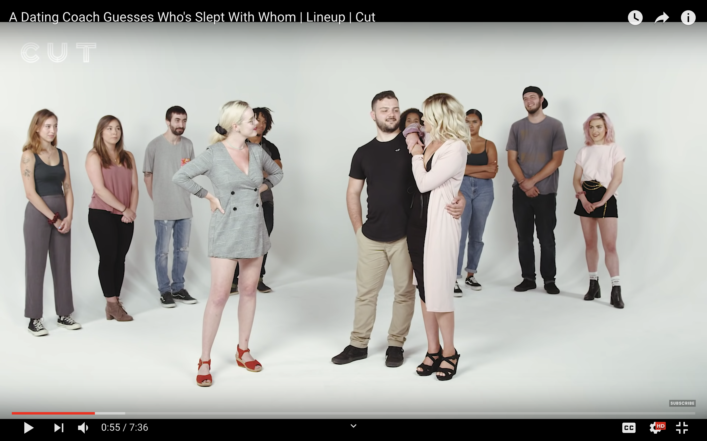

# 一般人にフォーカスしたチャンネル

---

割と014とかぶるけど

---

一般人にフォーカスあてて
企画をしてもらい
それをプロフェッショナルな感じで
プロヂュースするチャンネル
高い確率で来る

---

代表例:

Cut
https://www.youtube.com/user/watchcut/videos

---

---

バズった企画

- モテコンサルにヤッた5組を当てさせてみた
- セックス専門家に好きな体位を当てさせてみた
- 経験人数当てゲーム

---

---

---

訳しててあなたと同じことを思いました、
日本にも似たような企画ばっかだと。ただ、
素人の延長線上的な感じではなくて、

---

きちんとしたスタジオで
プロフェッショナルに、
一般人の個性を引き出すような感じ
でプロヂュースすれば
平気で1年で100万人行くと思う

---

欠点

- 単価コストが高い
- プロフェッショナルな演出が必須
- まとまった予算が必要
