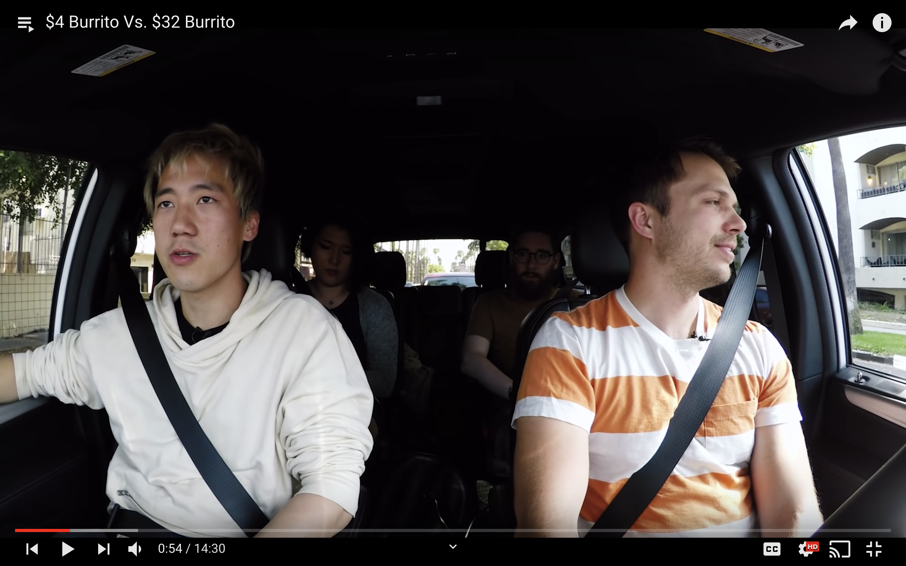
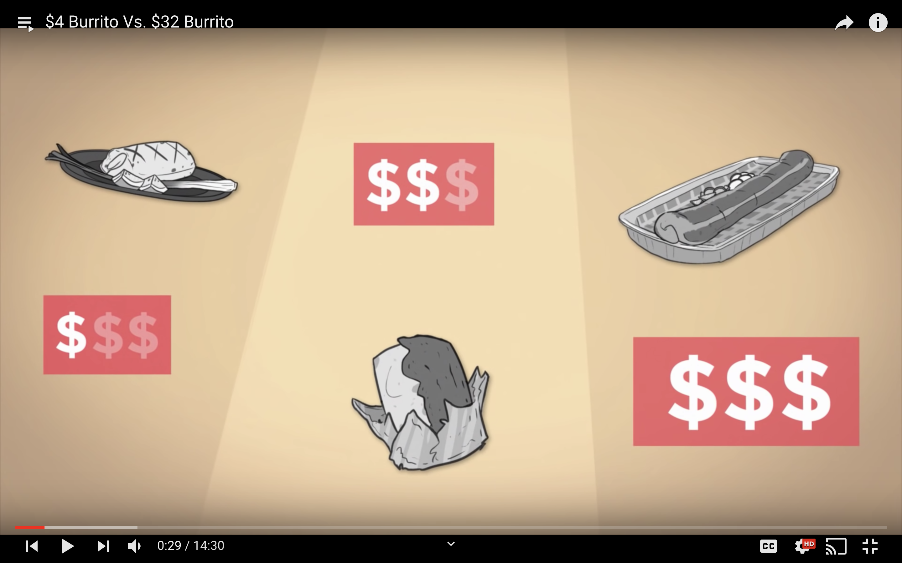
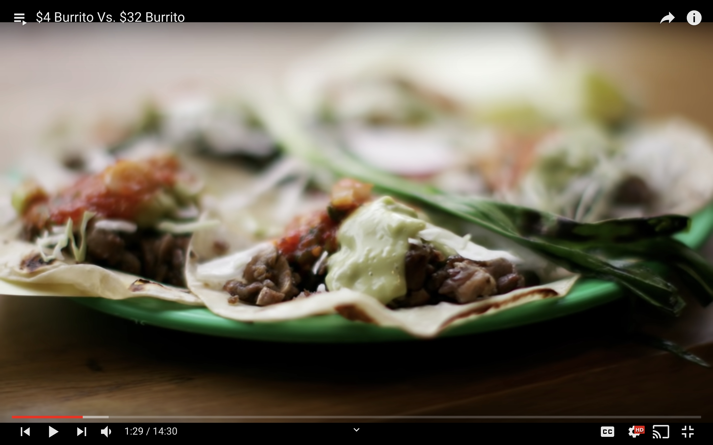

# worth-it パクリ

---

## worth-itとは、

buzzfeedにて
同じ食べ物を低価格・中価格・高価格帯で
比べてどれがコスパ良いか検証する番組シリーズ

---

---

buzzfeed というメガチャンネルにて
このシリーズだけ
視聴回数が異様に多い(平均数百万回数)

https://www.youtube.com/watch?v=lI4TS7RLbSA&list=PL5vtqDuUM1DmXwYYAQcyUwtcalp_SesZD

---

---

コスパが悪い良いよりも、
テレビ的なグルメ感を演出できる
のがとても癖になる

---

---

日本で食べ物ジャンルでよくあるのは

- 大食い
- ラーメン毎日食うやつ
- 高い寿司くってみた

---

今までは、過激なものしか
見られなかったから必然的に
食べ物ジャンルでもそうなっていった

---

日本でがちで「食」にフォーカスする
チャンネルっていまだかつてない

- 副次的にそのようなニーズを満たせるかも
