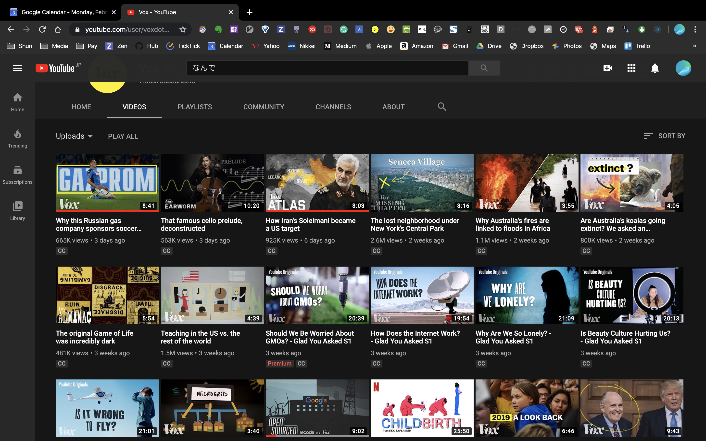

# 解説ドキュメンタリー動画

---

既存プレイヤーとして
解説動画市場を
牛耳ってるのは

- 中田あたりかな

---

中田も信憑性の問題が最近上がっているけど

---

よりテレビ的なドキュメンタリーちっくな
解説動画ってわりと
市場がら空きな気がする

---

海外だと
vox

- Stats
- Joined Mar 4, 2014
- 1,752,955,929 views

---

---

利点

- 社会的に意義がある
- 単価はそこまで高くない
- リーチできる層が広い

---

欠点

- スケールしにくい
- 最初は伸びない
- 属人性・ブランド性どちらも薄い
